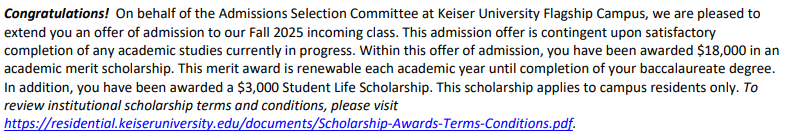

# College Applications... for me.

So uh, it's my senior year of high school. I applied to a few colleges (most of which are in Florida because I live in Florida), and I got some of my decisions back.

Since I already know people are **going** to ask this, here are my stats:

## Stats

3.6 Unweighted GPA / 4.4 Weighted GPA \
1370 SAT (670 EBRW, 700 Math) \
One AP class taken (AP Precalculus, 4 on the exam)\* \
Multiple AICE classes taken:

-   General Paper
-   English Lang AS
-   English Lang A
-   Marine Science AS
-   International History
-   US History

Extracurriculars:

-   Secretary of the eSports Club (yeah, programming and "pro gaming")
-   Programming (duh, I mean I'm writing this on a blog that I sat here and made)

And so far I have applied to these schools (submitted an application to already):

-   Keiser University
-   Florida Tech
-   University of North Florida
-   University of Central Florida
-   Florida State University
-   Florida Atlantic University
-   University of South Florida
-   University of Florida
-   MIT
-   Harvard (ain't no shame in trying, right?)
-   Georgia Tech

## Results (so far)

I got my first decision back from Keiser University, and I got in! I don't know if I'll go there, but it's a start.
But to be fair, it's a school with a 90%+ acceptance rate. It was more or less a safety school.

I got accepted into Florida Tech, but I don't think I'll go there either. It's a bit too expensive for me unless I get some serious financial assistance.

I got accepted into the University of North Florida, and I'm not considering it. I never actually heard of the school until I googled for Florida Universities.

I got accepted into the University of Central Florida, and I'm considering going there. It's a great school and is often ranked the best school in Florida for CS.

I got accepted to Florida State University, and I can see it as an option for me. It's a great school, and I have several friends who are currently there.

I got accepted to Florida Atlantic University, and I'm not considering it. I don't think it's a good fit for me.

And that's where it ends.

MIT, Harvard, and UF decisions come back on March 14th. \
Georgia Tech decisions come back in late March for out-of-state students.
