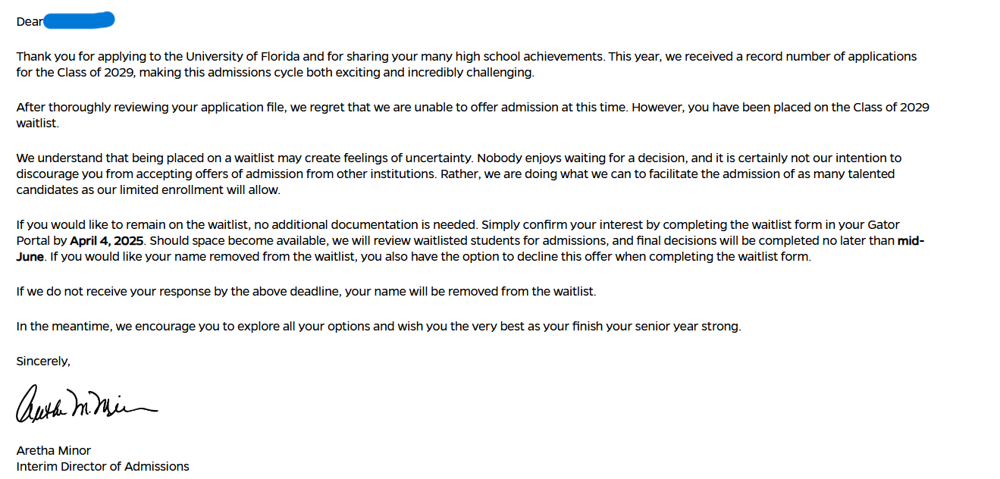

Well, this is a follow-up post to my previous post about my college applications. I've gotten more decisions back.

I received two decisions on March 14th, MIT and UF. What were my results?

## Results

### MIT

I got **rejected.** No biggie though, I wasn't expecting to get in.

### University of Florida

I got **waitlisted.** I'm assuming it's because they ran out of seats for my major (Computer Science), and could not offer me an admission.
I have the option to fill out a form to stay on the waitlist, but I don't think I will. I'm not too keen on waiting for a decision that will take to June to come.

Plus, I plan on attending the University of Central Florida. It has _arguably_ the best Computer Science program in Florida (not sponsored to say that), and I love the Orlando area. I'm excited to start my journey there.

Georgia Tech and Harvard (and UF) are the last ones to go.
