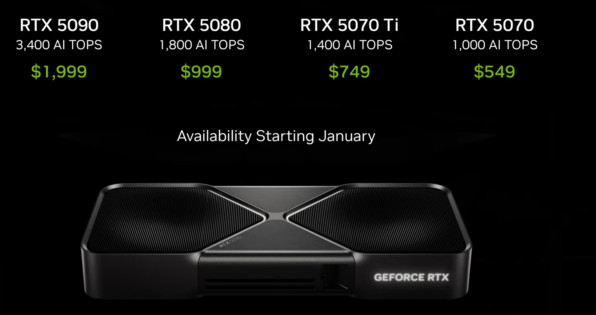

# CES 2025 (Nvidia)

Nvidia unveiled its RTX 50 series at CES 2025, and I have some thoughts about them.

# RTX 40 Series Retrospect

A year ago, I posted about why the RTX 40 series was disappointing.
It was incredibly overpriced and didn't bring an uplift as great as we have seen from RTX 20 to RTX 30.

But with the release of the RTX 50 series, there is a bit of hope.

# RTX 50 Series

## RTX 5090, the $2000 behemoth

The RTX 5090 is the flagship card of the RTX 50 series, and it's a beast. It's priced at $2000, a 25% increase from the RTX 4090 at $1500.

Surely that extra 500 dollars packs a punch, right?

Well somewhat. RTX 5090 has 32GB of GDDR7 memory, a first for the GeForce series. RTX 4090 had 24GB of GDDR6X.
That's a LOT more VRAM for sure, but shouldn't it be prioritized for the lower-end cards?

### VRAM Dilemma

Since 2023, people have been very upset with Nvidia's entry-level and midrange cards having 8GB of VRAM. Most newer titles use 8K textures,
which quickly exhaust all 8 gigabytes of memory very quickly. This causes a lot of stutters, crashes, or textures being loaded at lower resolutions.

The GTX 1080 was released in 2016, and the RTX 4060 in 2024. Both cards have 8GB of VRAM. A 2016 flagship GPU vs a 2024 midrange GPU.
One targets 4K gaming, and the other targets 1080p gaming. Many people do not like this.

But back to the 5090, even as an enthusiast card, do you REALLY need 32GB of VRAM?
I can understand if you're locally running LLMs on it (such as Llama 3.1 405B), but shouldn't these LLMs be capable of running on 24GB?

It causes a lot of disparity among the VRAM sizes on the cards.

The entry-level GTX 1050 Ti was 4GB of GDDR5. The flagship GTX 1080 Ti was 11GB of GDDR5X.
That's almost a 3x difference. But assuming that RTX 5060 is 8GB, that's a 4x difference between it and RTX 5090.

I just don't understand it.

In terms of performance uplift, Nvidia didn't show off the _raw_ raster performance of the 5090, but a video showcasing the cards
performance on DLSS4 (we'll get to this later) shows about a 30% performance uplift.

<iframe
	width="851"
	height="478"
	src="https://www.youtube.com/embed/_YXbkGuw3O8"
	title="DLSS 4 vs DLSS Off Comparison | Cyberpunk 2077"
	frameBorder="0"
	allow="accelerometer; autoplay; clipboard-write; encrypted-media; gyroscope; picture-in-picture; web-share"
	referrerpolicy="strict-origin-when-cross-origin"
	allowfullscreen
></iframe>

Here, you can see RTX 5090 hovering at about 27 FPS on Cyberpunk 2077 4K Ultra Settings and Path Tracing with DLSS Off.

<iframe
	width="851"
	height="478"
	src="https://www.youtube.com/embed/QGI8EIgf8Y8"
	title="Cyberpunk 2077 | 4K DLSS 3.5 Comparison"
	frameborder="0"
	allow="accelerometer; autoplay; clipboard-write; encrypted-media; gyroscope; picture-in-picture; web-share"
	referrerpolicy="strict-origin-when-cross-origin"
	allowfullscreen
></iframe>

Here, you can see RTX 4090 hovering at about 20 FPS on Cyberpunk 2077 4K Ultra Settings and Path Tracing with DLSS Off.

27 / 20 = 1.35

That's a 35% uplift.

Nvidia used to have around a 50% uplift per generation back then, so this is a bit underwhelming. Especially for the 500-dollar price increase.

## RTX 5080

RTX 5080 has 16GB of GDDR7 and is only $999.
RTX 4080 was 16GB of GDDR6X and was $1299 USD, with its SUPER variant being $999 USD.

I would've preferred this card to have 24GB of GDDR7, but great job Nvidia for a price reduction. 😎

## RTX 5070 and RTX 5070 Ti

This one gets a little controversial. Jensen Huang stated that the RTX 5070 has the same performance as the RTX 4090.

At first, people go "LET'S GO" until he followed up with **impossible without AI**.
This means that the card _could_ be getting that type of performance through DLSS.

RTX 5070 is $549 USD, a good price point. However, this card should've been 16GB of GDDR7 in my opinion.
RTX 5070 Ti is $749 but with 16GB of GDDR7. A bit on the pricier side, but I don't have much information on this card's performance.

## DLSS 4

This seemed to be Nvidia's true announcer at CES. DLSS 4. What does it bring to the table?

For one, they swapped DLSS from using a Convolutional Neural Network **(CNN)** to a Transformer model.

Nvidia states that this model is more efficient and can produce better results than the previous model.
Less artifacts, ghosting, higher fidelity, all the nitty gritty stuff.

This change is also backward compatible with all RTX cards, so RTX 20, 30, and 40 series owners can use it.

In addition to that, DLSS 4 brings **Multi-Frame Generation**. Whereas DLSS 3 was able to generate one AI frame for one real frame, DLSS 4 can generate 3 AI frames for one real frame.
This effectively QUADRUPLES the frame rate. That is insane.

This feature is unfortunately locked behind RTX 50 series cards, so RTX 40, 30, and 20 owners can't use it.

## Nvidia Reflex 2

To combat the latency added by MFG, Nvidia introduced Nvidia Reflex 2. This is a feature that reduces input latency by 50%, by using a new feature called "Frame Warp" to reduce system latency.

<iframe
	width="853"
	height="480"
	src="https://www.youtube.com/embed/zpDxo2m6Sko"
	title="NVIDIA Reflex 2 | Introducing New Frame Warp Technology"
	frameborder="0"
	allow="accelerometer; autoplay; clipboard-write; encrypted-media; gyroscope; picture-in-picture; web-share"
	referrerpolicy="strict-origin-when-cross-origin"
	allowfullscreen
></iframe>

I can see it being very useful for competitive game players like me 😎.

Reflex 2 will be available for the RTX 50 Series first, with support for the older RTX series later in the future.

# Conclusion

The RTX 50 series is a mixed bag. I am interested in this series, but it could have been better.
I can't say much since it's not the entire series (60 and maybe 50 down the line) but:

-   The RTX 5090 seems nice, but overpriced. 32GB of VRAM is a bit overkill.
-   The RTX 5080 seems great, but I would've preferred 24GB of VRAM. Great price reduction though.
-   The RTX 5070 and 5070 Ti seem like good high-end GPUs, but the 5070 should've been 16GB of VRAM.

I just hope that Nvidia doesn't fumble the RTX 5060 and (potentially) 5050. PLEASE make them 12GB cards.
